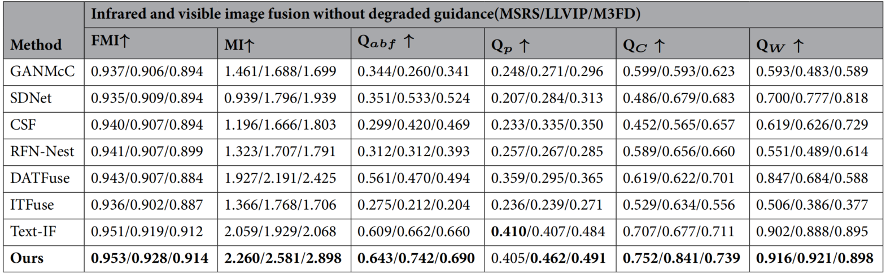

# [Scientific Reports 2026] A VLM guided network coupling degradation modeling for degradation aware infrared and visible image fusion
### [Paper](https://www.nature.com/articles/s41598-026-38181-8) | [Code](https://github.com/Lmmh058/VGDCFusion) 

**A VLM guided network coupling degradation modeling for degradation aware infrared and visible image fusion (Scientific Reports 2026)**

## Prepare Your Dataset
The images you use should be placed in:
```bash
#For Test (Image Fusion without degradations)
    dataset/
            {dataset}/
                        Infrared/
                        Visible/

#For Train (Image Fusion without degradations)
    Train/
            Text_Train/
                        ir/
                        vi/
                        text.txt
```

## Pretrained Weights
Our pre-trained model is available at [Google Drive](https://drive.google.com/file/d/1KymqqQ0jIHGmvnBMcsHP-_vYb3KuHjyE/view?usp=sharing).
After downloading, please place the pre-trained model in ```./pretrained_weights```.

## Testing
You can test the fusion performance of the model using the following command, after correctly placing the test images and the pretrained model:
```
python test_from_dataset.py
```

## Visual Results
A few qualitative examples are shown below.


## Quantitative Results
Quantitative comparison examples are shown below. Higher values of all other metrics indicate better performance.



## Training your own model
Put your training data, and run:
```
python train_fusion.py
```
Afterwards, your model will be placed in ```./experiments```.

## Citation
If our work contributes to your research, please cite it as:
```
@article{zhao2026vlm,
  title={A VLM guided network coupling degradation modeling for degradation aware infrared and visible image fusion},
  author={Zhao, Jufeng and Zhang, Tianpei and Cui, Guangmang},
  journal={Scientific Reports},
  year={2026},
  publisher={Nature Publishing Group UK London}
}
```
