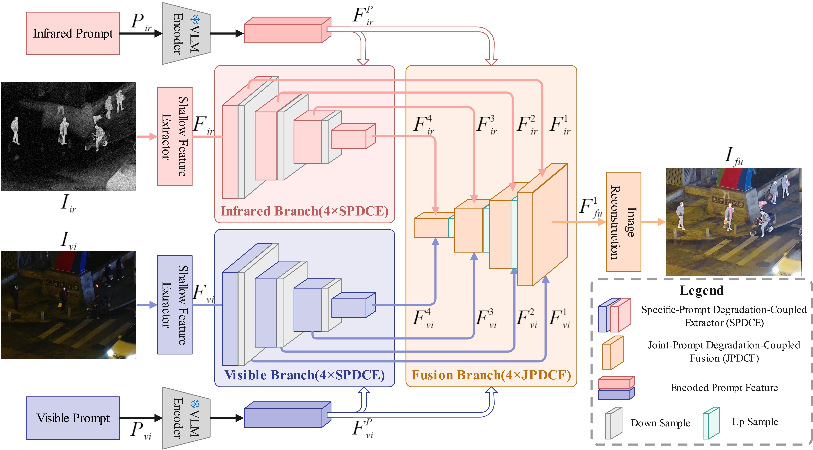

# [Scientific Reports 2026] A VLM guided network coupling degradation modeling for degradation aware infrared and visible image fusion
### [Paper](https://www.nature.com/articles/s41598-026-38181-8) | [Code](https://github.com/Lmmh058/VGDCFusion) 

**A VLM guided network coupling degradation modeling for degradation aware infrared and visible image fusion (Scientific Reports 2026)**



## Prepare Your Dataset
The dataset used in this paper can be downloaded at:
[EMS](https://github.com/XunpengYi/EMS) | [LLVIP](https://bupt-ai-cz.github.io/LLVIP/) | [MSRS](https://github.com/Linfeng-Tang/MSRS) | [M3FD](https://github.com/dlut-dimt/TarDAL) 

## Code Preparation and Execution Guide
The experimental code associated with this paper is organized into two parts: **Image Fusion without Degradations** and **Image Fusion with Degradations**. Detailed instructions for setup and execution can be found in the corresponding subdirectories.

## Citation
If our work contributes to your research, please cite it as:
```
@article{zhao2026vlm,
  title={A VLM guided network coupling degradation modeling for degradation aware infrared and visible image fusion},
  author={Zhao, Jufeng and Zhang, Tianpei and Cui, Guangmang},
  journal={Scientific Reports},
  year={2026},
  publisher={Nature Publishing Group UK London}
}
```
